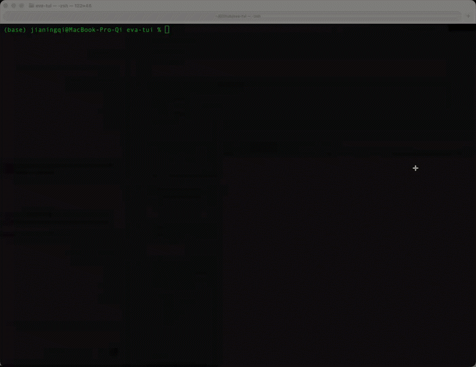

# EVA

> A cinematic command center for coding with Codex.

EVA is an experimental interface for Codex that turns an ordinary coding
session into an anime-inspired operations console. Plans become mission
phases, tool calls become station activity, approvals become command gates,
and workspace changes move through a live impact display.

Instead of putting chat at the center of the screen, EVA is designed to make
the whole session feel visible, active, and operational.



## What is EVA?

EVA is a separate client for Codex. It uses the Codex installation already on
your computer, including its authentication, configuration, models, tools, and
sandbox settings. It does not modify or replace Codex.

You can use EVA in two ways:

| Mode | Experience |
| --- | --- |
| `eva --tui` | A portable terminal interface with color, Unicode graphics, keyboard controls, and optional high-resolution terminal graphics. This is the default. |
| `eva --visual` | A local graphical console that opens in your browser and presents the same session as a larger command-center display. |

Both modes let you talk to Codex, follow its plan and activity, inspect
workspace impact, respond to approvals, interrupt a turn, and review the full
transcript.

## The idea

EVA is inspired by the command-center interfaces seen throughout *Neon Genesis
Evangelion*: dense information, bold warning states, sharp color hierarchy,
technical labels, synchronization displays, and the feeling that every action
belongs to a larger system.

The goal is not to recreate any single screen pixel for pixel. It is to
translate that visual language into a functional interface for real coding
work:

- important events should be impossible to miss;
- activity should feel connected to the system producing it;
- motion should communicate state, not decorate empty space;
- dense information should still be readable at a glance;
- the interface should feel cinematic without getting in your way.

EVA is an ongoing experiment in making a TUI feel less like a text form and
more like an instrument panel.

## What you can do

- **Run Codex in any workspace.** Start EVA in a project and send instructions
  just as you would in another Codex client.
- **Watch the operation unfold.** Follow the active plan, turn status, token
  use, tool calls, file activity, and human-to-Codex synchronization.
- **Move between focused views.** Use Operations, Stations, Impact, and
  Transcript to inspect the session from different angles.
- **Stay in control.** Approve or decline requested actions, authorize a
  request for the session, or interrupt an active turn.
- **Choose the rendering style.** Use the portable text renderer everywhere or
  enable richer Kitty graphics in supported terminals.
- **Add atmosphere if you want it.** Play a local audio file, an original
  generated ambient loop, or a track through the visible YouTube companion
  player. Audio is off by default.

## Quick start

### Requirements

- Node.js 22 or newer
- A current `codex` CLI installed, authenticated, and available on your
  `PATH`
- A terminal with color and Unicode support

For the graphical console, you also need a modern browser.

### Install

```sh
git clone https://github.com/user074/eva-tui.git
cd eva-tui
npm install
npm run build
npm link
```

### Start EVA

Open the terminal interface in your current project:

```sh
eva
```

Open a specific workspace:

```sh
eva --cwd /path/to/project
```

Or launch the local graphical console:

```sh
eva --visual --cwd /path/to/project
```

The graphical console binds only to `127.0.0.1` and opens in your default
browser. It is a local renderer, not a hosted service.

## Everyday controls

| Key | Action |
| --- | --- |
| `Enter` | Send your instruction to Codex |
| `Tab` / `Shift-Tab` | Cycle through Operations, Stations, Impact, and Transcript |
| Mouse wheel / `Up` / `Down` | Scroll the conversation or inspect station activity |
| `Page Up` / `Page Down` | Scroll the active conversation view |
| `Escape` | Return to Operations or dismiss a simulation |
| `Ctrl-C` | Interrupt an active turn; exit while idle |
| `Ctrl-G` | Toggle audio |
| `Ctrl-Q` | Exit EVA |
| `Y` / `A` / `N` | Approve once, approve for the session, or decline |

Apple Terminal users should enable **View → Allow Mouse Reporting** for
trackpad scrolling.

## Useful options

```sh
eva --tui
eva --visual
eva --model <model-name>
eva --graphics text
eva --graphics auto
eva --graphics kitty
eva --music "/path/to/your/track.mp3"
eva --youtube "https://music.youtube.com/watch?v=..."
eva --audio
```

- `--graphics text` uses the portable renderer and works in standard
  terminals.
- `--graphics auto` enables the image renderer when EVA detects a compatible
  terminal.
- `--graphics kitty` explicitly requests Kitty graphics support in Kitty,
  Ghostty, or WezTerm.
- `--music` and `--youtube` are optional and cannot be used together.

Run `eva --help` for the complete command reference.

## Safe visual simulations

EVA includes earthquake and tsunami interface simulations so you can explore
the visual system without changing your workspace or starting a Codex turn.

```text
/simulate earthquake
/simulate earthquake 75
/simulate tsunami
```

Every simulation is clearly marked `試験 / SIMULATION`.

## Project status

EVA is experimental software. Version 0.5 supports the core Codex thread and
turn experience, live operational views, approvals, interruption, simulations,
audio controls, and both terminal and local-browser rendering.

Expect the interface to keep evolving as the visual language becomes more
cohesive and the Codex app-server surface develops.

## Learn more

- [TUI design guide](docs/TUI_DESIGN_GUIDE.md) — visual vocabulary, layout,
  color, motion, and reference mapping
- [Visual console](docs/VISUAL_CONSOLE.md) — local graphical renderer and
  security boundary
- [Ratatui prototype](docs/RATATUI_PROTOTYPE.md) — higher-fidelity native TUI
  experiment

For contributors:

```sh
npm run dev -- --tui
npm run dev -- --visual
npm run typecheck
npm test
```

## Inspiration and attribution

EVA takes broad creative inspiration from the command-center interfaces of
*Neon Genesis Evangelion* and from community projects including
[ews-concept-new](https://github.com/bagusindrayana/ews-concept-new) and
[nerv-ui](https://github.com/mdrbx/nerv-ui).

Selected warning, stripe, hex, and station-blade assets from
`ews-concept-new` are included under its modified MIT license. Full
attribution and the upstream license are available in
[THIRD_PARTY_NOTICES.md](THIRD_PARTY_NOTICES.md) and
`assets/ews-concept-new/LICENSE`.

No anime screenshots, official logos, commercial fonts, or copyrighted music
are distributed with this project. EVA is an unofficial fan-made project and
is not affiliated with or endorsed by the referenced creators, projects, or
rights holders.

## License

EVA is licensed under the Apache License 2.0.
